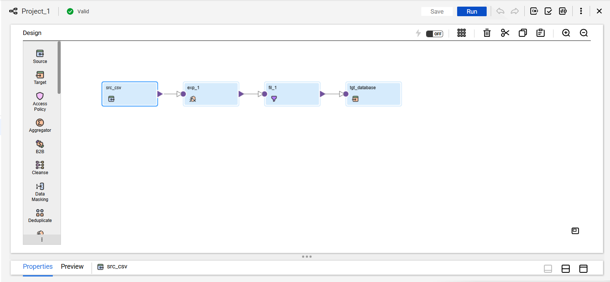
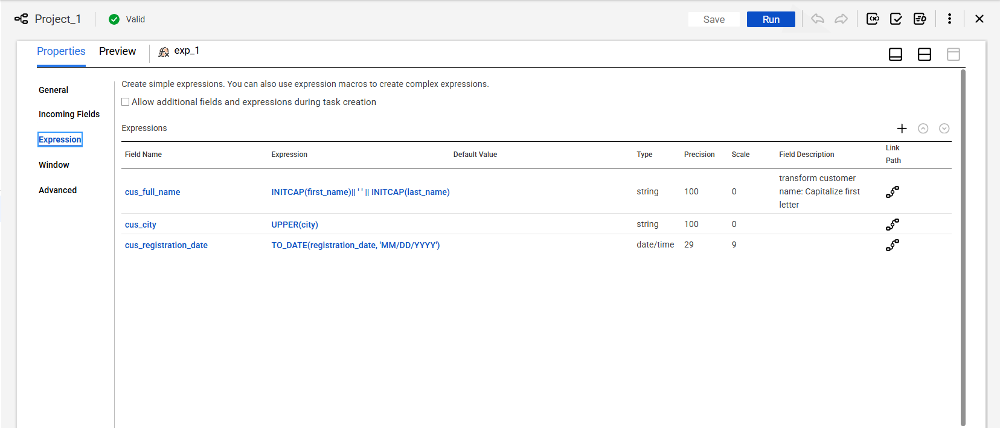
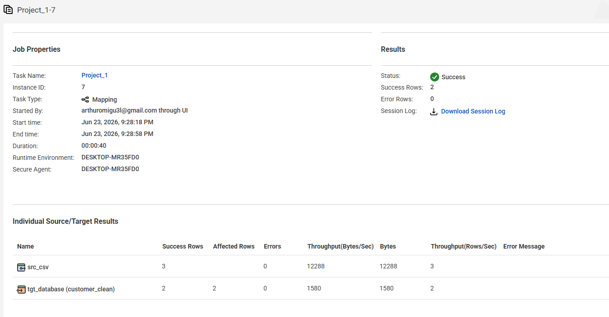
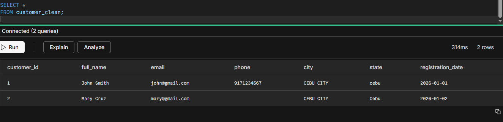

# Project 1: Customer Data Cleansing & Standardization Pipeline (IICS)

## Business Case
In real-world enterprise environments, marketing teams frequently capture raw customer data from decentralized web forms, landing pages, and third-party platforms. This raw data is notoriously "dirty"—plagued by inconsistent casing, missing fields, and malformed email syntaxes. 

This project implements a cloud data pipeline using **Informatica Intelligent Cloud Services (IICS)** to ingest, clean, validate, and standardize raw customer CSV data before loading it into a production database.

## Pipeline Architecture


### Key Design Patterns Used:
* **Centralized Data Formatting:** Consolidated all text cleaning (`INITCAP`, `UPPER`) and date type-casting (`TO_DATE`) into a single Expression transformation (exp_1). This keeps the mapping clean and efficient by handling all formatting in one place instead of using multiple transformations.
* **Data Validation Filtering:** Implemented a downstream Filter transformation (`fil_1`) using the `INSTR` function to check specific string patterns. This allows the pipeline to instantly identify and drop bad or malformed records before they ever reach the target database.

---

## Detailed Transformation Breakdown

<details>
<summary>📊 Click to view Expression Logic & Field Calculations</summary>

The core formatting engine leverages an Expression transformation (`exp_1`) to evaluate incoming constraints, clean string data, and enforce proper database type-casting.



#### 1. Standardization Logic Configuration
Within `exp_1`, raw incoming fields are standardized using the following programmatic expressions:
* **Full Name Generation:** Concatenates first and last names while forcing proper title casing to correct messy inputs (e.g., `john` or `MARY`).
  ```sql
  INITCAP(first_name) || ' ' || INITCAP(last_name)

* **State & City Capitalization:** Forces regional state/city values to absolute uppercase to ensure uniform reporting entries for downstream BI tools.
  ```sql
  UPPER(state)
  
* **Date Type-Casting & Schema Alignment:** Because flat CSV source files default all incoming metadata to generic string/varchar data types within IICS, explicit data type coercion was required. This logic programmatically transforms the raw date strings into native database-compliant DATE objects, ensuring strict target schema alignment and preventing structural write failures.
  ```sql
  TO_DATE(registration_date, 'YYYY-MM-DD')

#### 2. Filter Condition Configuration
The filter evaluates the email string using an inline function to ensure an @ symbol is present. Any record missing this mandatory anchor (such as row 3's invalidemail) returns a value of 0 and is safely dropped from the pipeline stream.
  ```sql
  INSTR(email, '@') > 0
  ```
</details>

---

## Post-ETL Verification & Execution Metrics

#### 1. IICS Monitor Task Log
When executed with the sample dataset containing inconsistent casing and a structurally malformed email, the pipeline executed with a 100% Success Status. Out of 3 source rows read, 2 clean records successfully updated the target database, while 1 corrupt row was cleanly isolated and dropped.


#### 2. Database Target Verification
Running an audit query against the target database table confirms that formatting rules applied perfectly: names are merged and title-cased, states/cities are successfully uppercased, string dates are converted to native dates, and the invalid email record was entirely blocked from polluting production.
  ```sql
  SELECT * FROM customer_clean;
  ```

