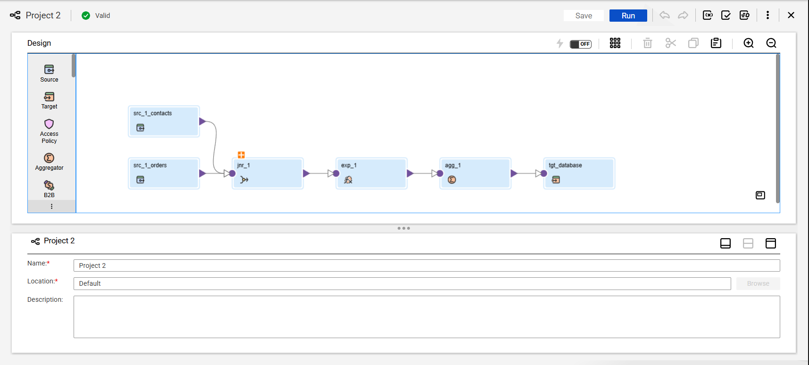
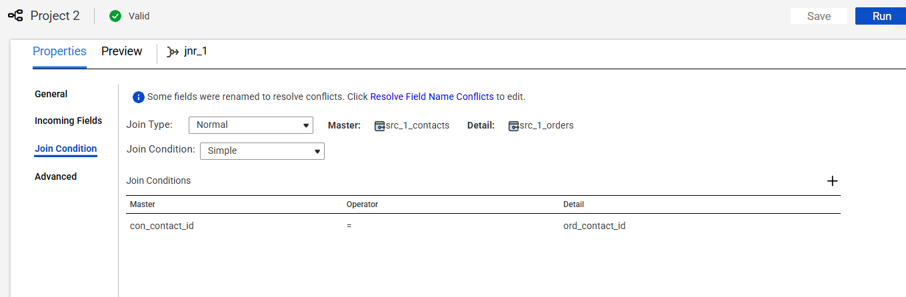
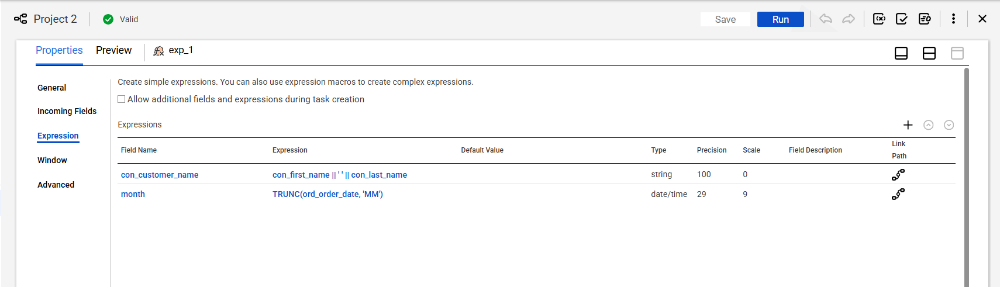
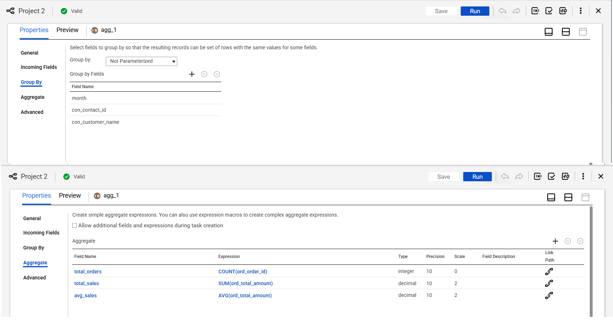
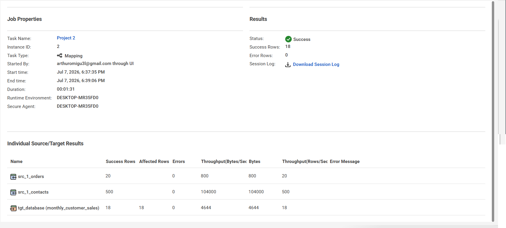
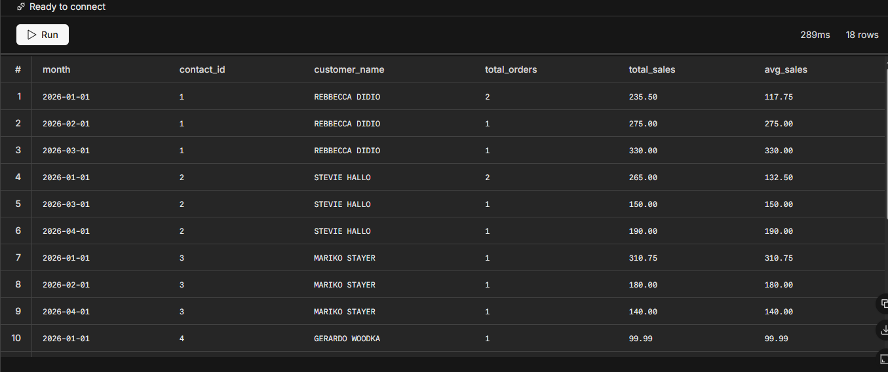

# Project 2: Monthly Customer Sales Analytics Pipeline

## Business Scenario & Objective
The business team requires an automated, high-performance monthly customer sales report to track revenue trends, order volumes, and customer buying behavior. 

The objective of this project is to build an end-to-end data integration pipeline in **Informatica Intelligent Cloud Services (IICS)** that consolidates siloed operational data (customer contacts and historical orders) from a transactional PostgreSQL database, executes aggregate business logic, and materializes a consolidated reporting layer.

---

## Pipeline Architecture

The workflow follows a standard enterprise data integration pattern, joining data at granular transaction layers before executing performance-optimized database aggregations.

    [Source: contacts] ───┐
                          ├─── [Joiner] ───► [Expression] ───► [Aggregator] ───► [Target: monthly_customer_sales]
    [Source: orders]   ───┘

### Visual Mapping Overview


---

## Design Logic & Developer Choices
> ### 🏗️ ETL Developer Challenge Analysis
> **Question:** *Should `customer_name` and `month` be created before or after the Aggregator transformation?*
> 
> **Solution:** They must be derived **BEFORE** the Aggregator transformation. 
> * **Reasoning:** The Aggregator needs to group transactions by both the individual calendar month and the unique customer name. If we attempted to calculate these fields *after* aggregation, the row-level granular fields (`first_name`, `last_name`, and `order_date`) would already be condensed and lost, causing pipeline compilation failures.

---

## Transformation Component Configurations

### 1. Joiner Transformation (`jnr_contacts_orders`)
* **Type:** Inner Join
* **Condition:** `contacts.contact_id = orders.contact_id`



### 2. Expression Transformation (`exp_derived_fields`)
Used to standardize text formatting and normalize granular date elements to a consistent monthly reporting structure.
* **`customer_name` (Output String):** `first_name || ' ' || last_name`
* **`month` (Output Date/Time):** `TRUNC(order_date, 'MM')` *(Utilizes native IICS date truncation logic to lock dates to the 1st of the calendar month)*



### 3. Aggregator Transformation (`agg_sales_metrics`)
* **Group By Keys:** `month`, `contact_id`, `customer_name`
* **Aggregate Calculations:**
  
| Output Port Name | Base Data Type | Transformation Expression |
| :--- | :--- | :--- |
| `total_orders` | Integer | `COUNT(order_id)` |
| `total_sales` | Decimal (10,2) | `SUM(total_amount)` |
| `avg_sales` | Decimal (10,2) | `AVG(total_amount)` |



---

## Pipeline Execution & Verification

### IICS Session Monitor Run Profile
Once triggered, the Cloud Secure Agent executed the aggregation matrices, reporting a clean run status without row drops or truncation warnings.



### Database Validation Query
To audit target storage integrity, the following data warehouse query was executed against the PostgreSQL environment:

```sql
SELECT 
    to_char(month, 'YYYY-MM') AS reporting_month,
    customer_name,
    total_orders,
    total_sales,
    avg_sales
FROM monthly_customer_sales
ORDER BY total_sales DESC;
```

### Final Materialized Results
