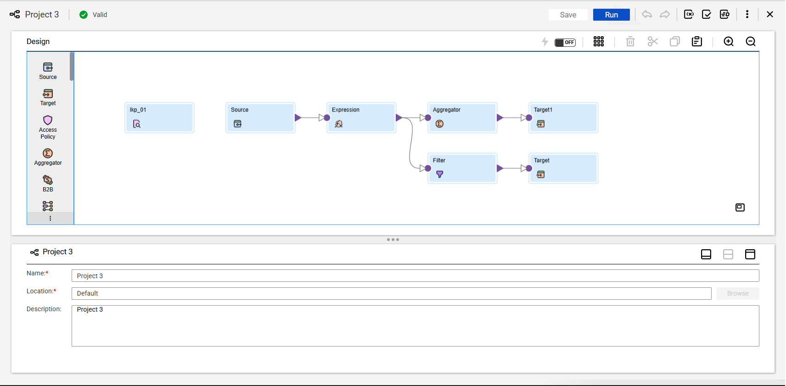
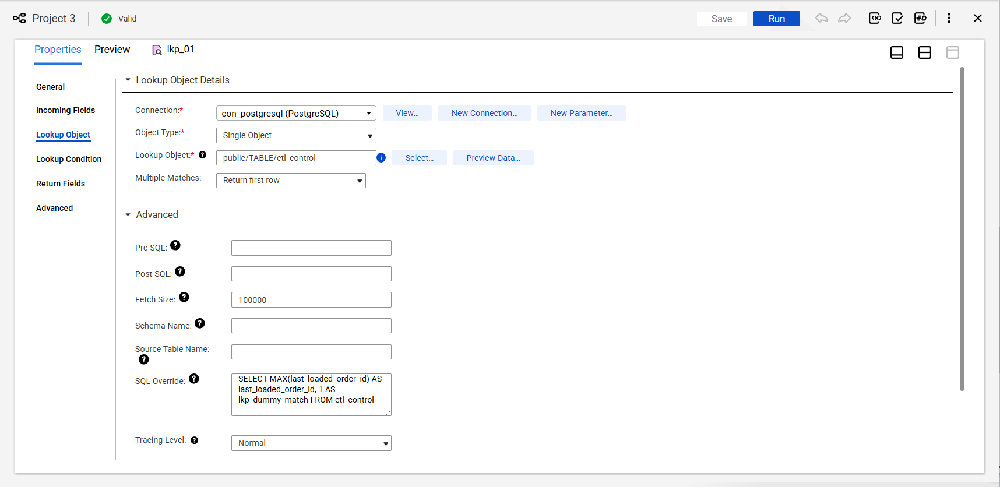
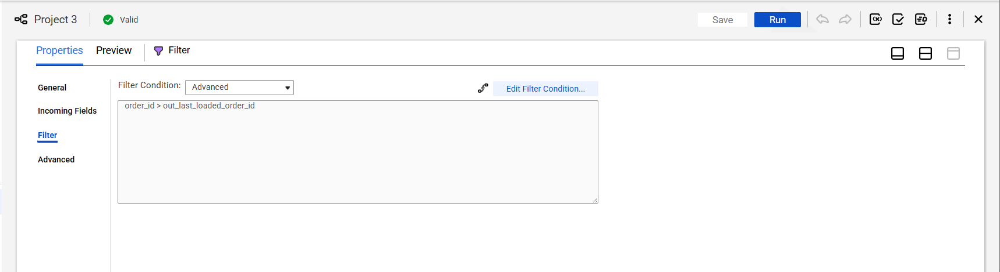
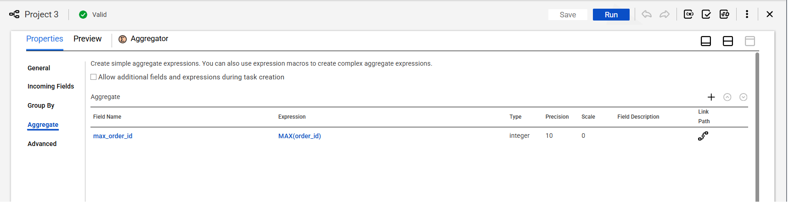
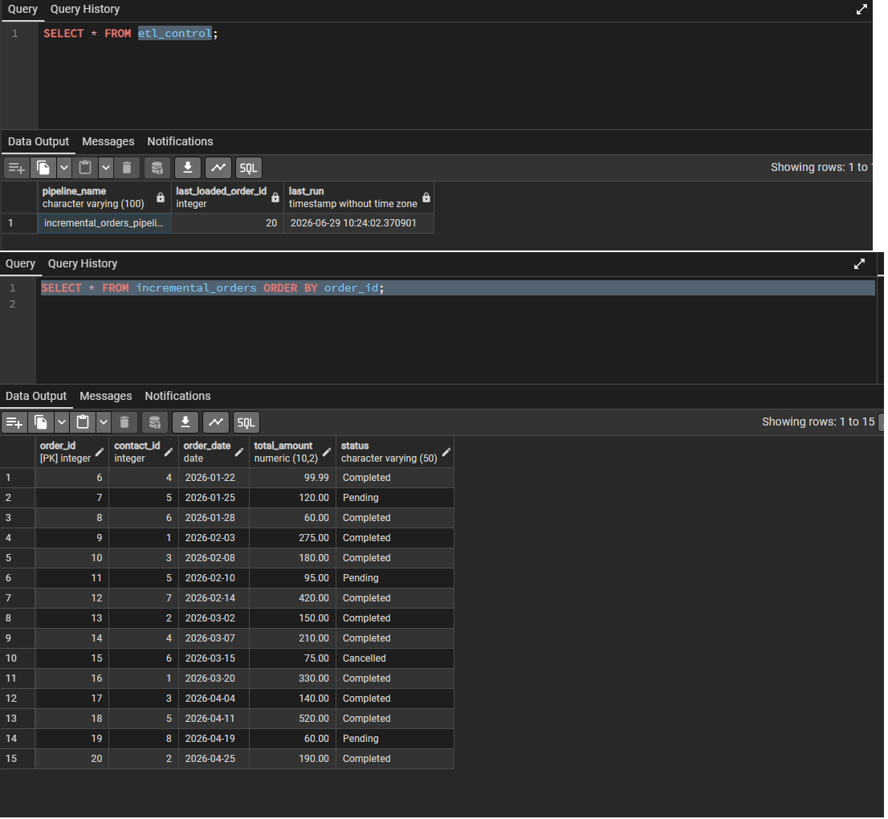

# Project 3: Incremental Load Pipeline (High-Water Mark Pattern)

## Business Scenario & Objective
In a production environment, performing a "Full Load" (truncating and reloading millions of records every day) is computationally expensive and highly inefficient. 

The objective of this project is to build an **Incremental Load (Delta) Pipeline** using a High-Water Mark (HWM) architecture. The pipeline queries an `etl_control` table to find the last successfully processed `order_id`, extracts only the *new* records that arrived after that ID, loads them into the target PostgreSQL database, and safely updates the control table with the new maximum ID.

---

## Pipeline Architecture

The workflow leverages a dual-target stream. The primary stream filters and inserts new records, while a secondary aggregation stream calculates the new high-water mark to update the control metadata.

    [Source: orders] ──► [Expression: Call Lookup] ──► [Filter: order_id > HWM] ──┬──► [Target 1: incremental_orders]
                                                                                  │
    [Unconnected LKP: etl_control]                                                └──► [Aggregator: MAX(order_id)] ──► [Target 2: Update etl_control]

### Visual Mapping Overview


---

## Engineering Logic & Developer Choices
> ### 🏗️ ETL Developer Challenge: The Unconnected Lookup Workaround
> **The Problem:** We need to fetch a single scalar value (the Max ID from `etl_control`) and apply it to every incoming source row. A standard Joiner or Connected Lookup would require a matching key on both sides, which we don't have.
> 
> **The Solution:** I implemented an **Unconnected Lookup** utilizing a custom SQL Override and a dummy matching condition.
> * **SQL Override:** `SELECT MAX(last_loaded_order_id) AS last_loaded_order_id, 1 AS lkp_dummy_match FROM etl_control`
> * **Why?** IICS strictly requires a condition to execute a lookup. By hardcoding `1 AS lkp_dummy_match` in the database query, I was able to pass a static `1` from my Expression transformation to successfully trigger the lookup and retrieve the High-Water Mark for the pipeline, avoiding expensive Cartesian joins.

---

## Metadata Control

### 1. ETL Control Table (High-Water Mark)
```sql
-- Metadata table to track pipeline execution state
CREATE TABLE etl_control (
    table_name           VARCHAR(50) PRIMARY KEY,
    last_loaded_order_id INT,
    last_run_timestamp   TIMESTAMP DEFAULT CURRENT_TIMESTAMP
);

-- Insert initial state (Assuming records 1-5 were loaded yesterday)
INSERT INTO etl_control (table_name, last_loaded_order_id) 
VALUES ('orders', 5);
```

---

## Transformation Component Configurations

### 1. Unconnected Lookup (`LKP_etl_control`)
* **Purpose:** Fetch the last successfully loaded `order_id`.
* **SQL Override:** `SELECT MAX(last_loaded_order_id) AS last_loaded_order_id, 1 AS lkp_dummy_match FROM etl_control`
* **Lookup Condition:** `lkp_dummy_match = in_dummy_match`



### 2. Expression Transformation (`EXP_call_lookup`)
* **Input Port:** `in_dummy_match` (Integer) = `1`
* **Output Port:** `out_last_loaded_order_id` (Integer) = `:LKP.LKP_etl_control(in_dummy_match)`

### 3. Filter Transformation (`FIL_new_records_only`)
* **Filter Condition:** `order_id > out_last_loaded_order_id`
* **Result:** Drops all historical records (e.g., IDs 1-5) and only passes the new delta rows (e.g., IDs 6-8) downstream.



### 4. Aggregator Transformation (`AGG_get_new_max`)
* **Purpose:** Calculate the highest `order_id` in the current batch to update the control table.
* **Output Port:** `max_order_id` = `MAX(order_id)`



---

## Pipeline Execution & Target Verification

### Execution Scenario
1. The `etl_control` table indicated the last loaded record was `5`.
2. Three new records (`6`, `7`, `8`) were inserted into the source system.
3. The pipeline was executed.

### Database Verification
Only the 3 new records were successfully written to `incremental_orders`, and the `etl_control` table safely updated its high-water mark to `8`.

```sql
-- 1. Verify only delta records were loaded
SELECT * FROM incremental_orders ORDER BY order_id;

-- 2. Verify Control Table updated successfully
SELECT * FROM etl_control;
```


