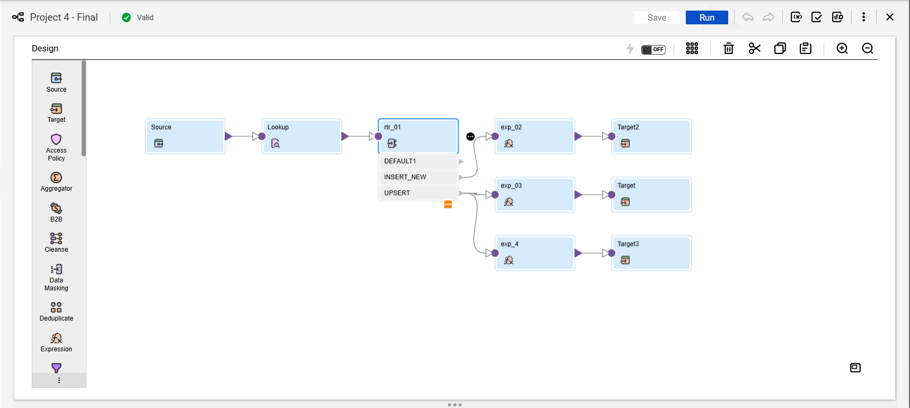

# Project 4: Employee Dimension Management (SCD Type 2 Ingestion)

## Business Scenario & Objective
A company's human resources and organizational structure data is highly dynamic. When an employee transitions to a new department, gets a promotion, or receives a compensation adjustment, analytics teams must be able to report on both their current assignment *and* their historical associations for accurate point-in-time revenue and performance analysis.

The objective of this project is to implement an enterprise-grade **Slowly Changing Dimension Type 2 (SCD Type 2)** data pipeline inside **Informatica Intelligent Cloud Services (IICS)**. This ensures that historical changes are preserved as distinct rows with chronological tracking metadata, rather than overwriting existing records.

---

## Pipeline Architecture

The workflow implements a pattern that queries the data warehouse target reactively, evaluates modifications inside an expression engine, and segregates operations through specialized transactional targets.

    [Source: employee_source] ──► [Lookup: dim_employee (Active Rows Only)] 
                                           │
    ┌──────────────────────────────────────┘
    ▼
    [Expression: SCD Logic Check] ──► [Router: Segment Operation Groups]
                                           ├──► [GRP_NEW_INSERTS] ──────────────────────────► [Target: dim_employee (Insert)]
                                           └──► [GRP_CHANGED_RECORDS] ─┬──► [Update Strat] ─► [Target: dim_employee (Expire Old)]
                                                                       └──► [Expression] ───► [Target: dim_employee (Insert New)]

### Visual Mapping Overview


---

## SCD Type 2 Ingestion Rule Matrix

The logic engine routes data streams based on three absolute transactional boundary rules:

| Evaluation Condition | Business State | Pipeline Execution Actions |
| :--- | :--- | :--- |
| **Lookup ID is Null** | New Hire / System Entry | Direct Insert: `current_flag = 'Y'`, `effective_date = TODAY`, `end_date = NULL` |
| **Lookup ID Matches & Fields Match** | No Operational Change | **Record Ignored:** Pipeline drops row quietly to optimize network throughput |
| **Lookup ID Matches & Fields Differ** | Structural HR Mutation | **Dual-Action Branch Execution:**<br>1. Expire existing row (`current_flag = 'N'`, `end_date = TODAY - 1`) via `DD_UPDATE`<br>2. Insert new version (`current_flag = 'Y'`, `effective_date = TODAY`, `end_date = NULL`) via `DD_INSERT` |

---

## Database Schema Specification

```sql
-- 1. Source Transactional Landing Table
CREATE TABLE employee_source (
    employee_id  INT PRIMARY KEY,
    first_name   VARCHAR(50),
    last_name    VARCHAR(50),
    department   VARCHAR(50),
    job_title    VARCHAR(50),
    salary       NUMERIC(10,2),
    hire_date    DATE
);

-- 2. Target Historical Analytical Dimension Table
CREATE TABLE dim_employee (
    surrogate_key  SERIAL PRIMARY KEY, -- Auto-incrementing warehouse identity key
    employee_id    INT,                -- Operational business key
    full_name      VARCHAR(100),
    department     VARCHAR(50),
    job_title      VARCHAR(50),
    salary         NUMERIC(10,2),
    effective_date DATE NOT NULL,      -- Dimensional record start date
    end_date       DATE,               -- Dimensional record expiration date
    current_flag   CHAR(1) NOT NULL    -- Active record tracker ('Y' or 'N')
);
```

---

## Transformation Component Configurations

### 1. Target Tracking Lookup (`LKP_dim_employee`)
* **Lookup Object:** `dim_employee`
* **Join Condition:** `employee_source.employee_id = dim_employee.employee_id`
* **Advanced Data Filter Override:** `dim_employee.current_flag = 'Y'`
> 💡 **Developer Note:** This pipeline explicitly utilizes the **Lookup Data Filter** under IICS Advanced Properties. Defending against the "Multiple-Change Lookup Trap," this filter forces the transformation cache to only ingest active warehouse records. This guarantees that historical matches evaluate against an employee's *most recent active state*, preventing accidental mismatches against stale, expired historical rows.

### 2. Expression Logical Engine (`EXP_scd2_logic`)
Derives structural audit elements and computes conditional boolean flags before streaming data to the transaction router.
* **`out_full_name`:** `first_name || ' ' || last_name`
* **`v_is_new`:** `ISNULL(lkp_surrogate_key)`
* **`v_is_changed`:** `NOT ISNULL(lkp_surrogate_key) AND (src_department != lkp_department OR src_job_title != lkp_job_title OR src_salary != lkp_salary)`


### 3. Stream Routing Engine (`RTR_scd2_routing`)
* **Group 1 (New Hire Path):** `v_is_new`
* **Group 2 (Change Expire/Insert Path):** `v_is_changed`


### 4. Update Strategy Execution (`UPD_expire_old_record`)
* **Target Stream:** Pointed at the historical tracking target line.
* **Expression Action:** `DD_UPDATE`
* **Port Mutations:** Maps `current_flag = 'N'` and `end_date = SYSDATE - 1` directly to the matching target record to terminate its active analytical window.


---

## Verification & Execution Profiling

### Scenario Validation Run
To simulate a real-world corporate reorganization, an employee profile was updated inside the source file, altering their department metadata from `IT` to `Finance`.

```sql
-- Post-ETL Audit Query to Track Historical Change Resolution
SELECT 
    employee_id, 
    full_name, 
    department, 
    effective_date, 
    end_date, 
    current_flag 
FROM dim_employee 
WHERE employee_id = 101 
ORDER BY effective_date ASC;
```

### Materialized Analytical Output
The database layout cleanly reflects the historical preservation asset, accurately setting timestamps and structural flags without manual script intervention:

| employee_id | full_name | department | effective_date | end_date | current_flag |
| :--- | :--- | :--- | :--- | :--- | :--- |
| 101 | John Doe | IT | 2026-01-01 | 2026-04-30 | N |
| 101 | John Doe | Finance | 2026-05-01 | NULL | Y |


---

## 🛠️ Production-Hardening Opportunities (Senior Engineering Scope)
While this visual mapping architecture flawlessly manages standard SCD Type 2 processing criteria, the following design frameworks are accounted for deployment within enterprise scaling operations:

1. **Defusing Variant Null Assertions:** Standard inequality evaluations (`src_col != lkp_col`) can fail or yield unexpected null evaluations if an operational attribute arrives empty from source endpoints. In high-volume production setups, these comparisons are safely wrapped using localized string fallbacks, e.g., `IIF(ISNULL(src_department), '', src_department) != IIF(ISNULL(lkp_department), '', lkp_department)`.
2. **MD5 Change-Hash Vectors:** For enterprise dimensions containing dozens of trackable attributes, chaining extensive strings of sequential `OR` comparison conditions becomes highly unwieldy and error-prone. A scaling best practice involves generating a single data signature port utilizing `MD5(field1 || field2 || ...)` within both the staging mapping and target warehouse. The pipeline can then evaluate a single, streamlined string comparison link to identify data modifications instantaneously.