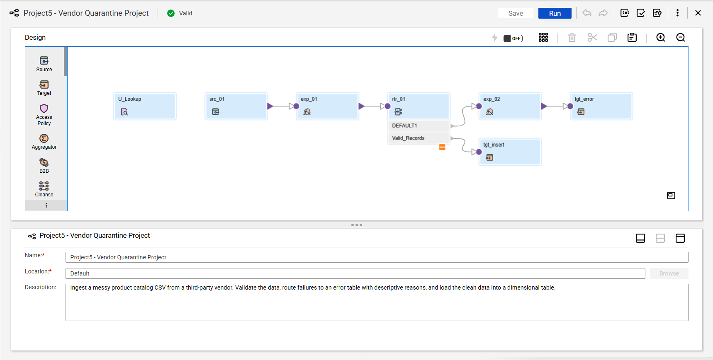
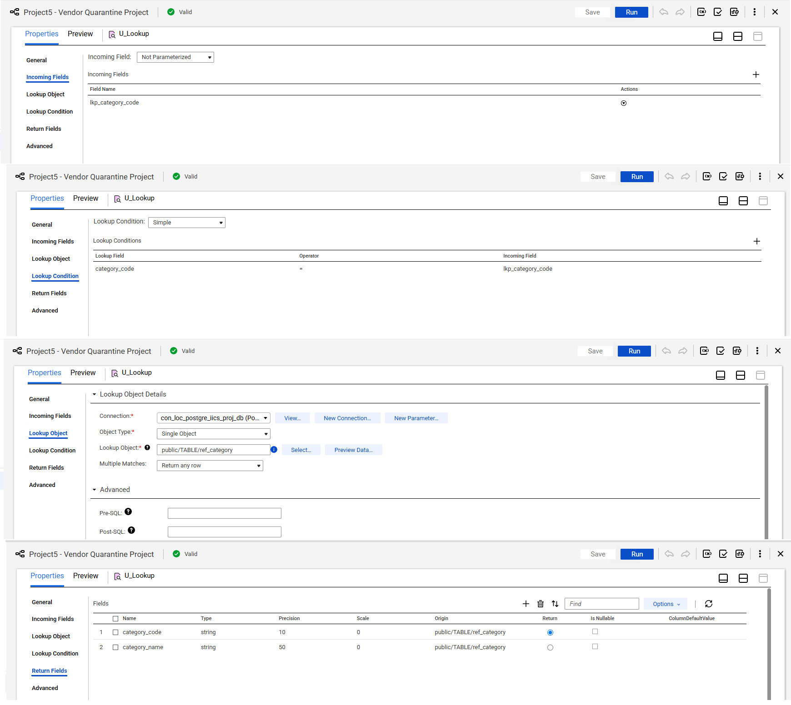
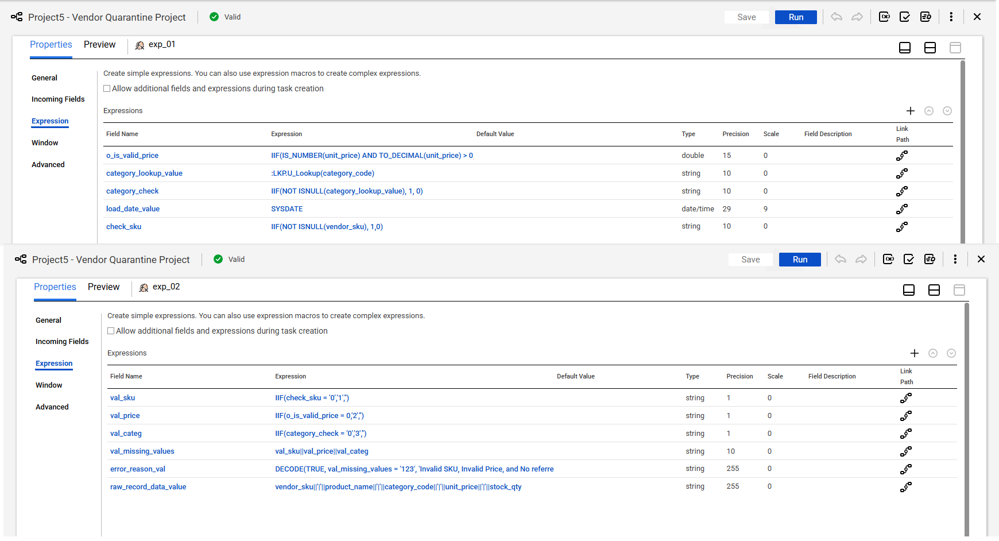
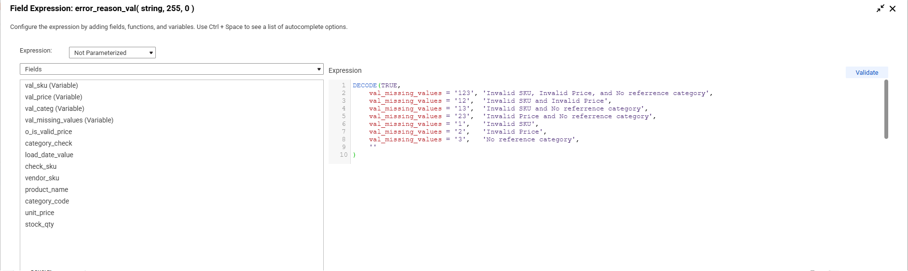
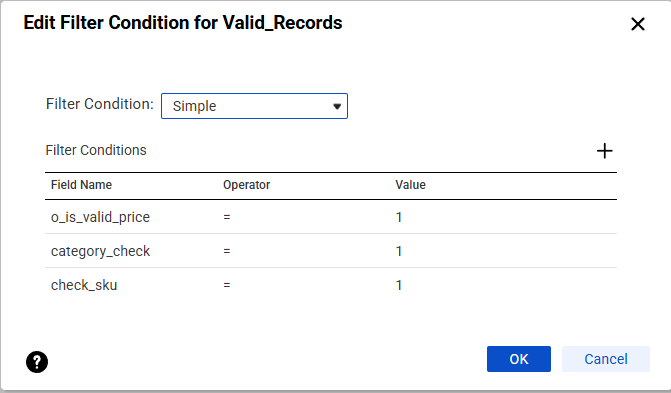
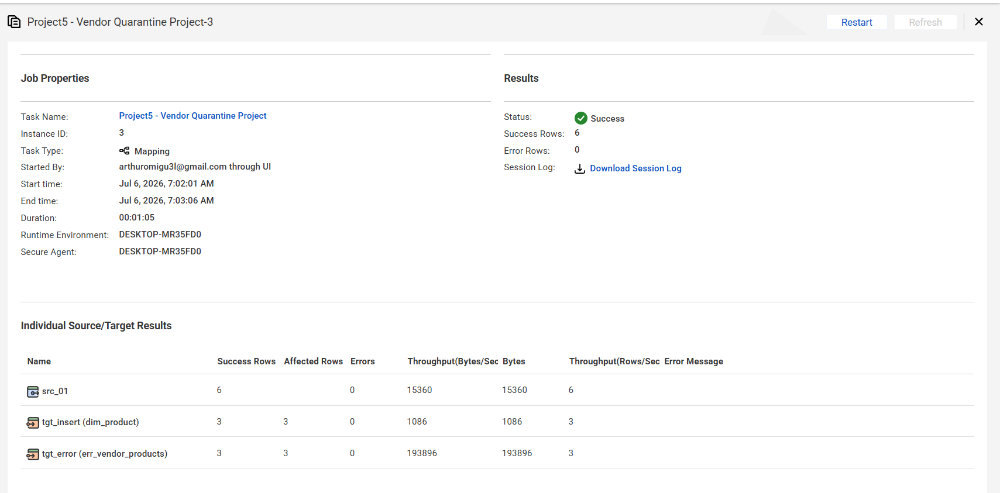
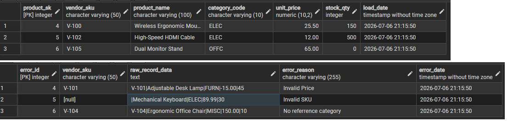

# Project 1: Vendor Data Quarantine Pipeline (IICS & PostgreSQL)

## Business Case
Third-party vendor data is inherently dirty, missing critical fields, or violating business data types. This robust ETL pipeline ensures that invalid product catalogs do not break or pollute downstream analytics warehouses. It isolates corrupt rows into a dedicated quarantine/error log table for data-steward inspection while smoothly passing clean, verified records into the production dimensional schema.

## Pipeline Architecture

### Key Design Patterns Used:
* **Unconnected Lookup Module:** Leveraged an independent unconnected lookup (`U_Lookup`) called inline via expression to reduce mapping canvas footprint and avoid unnecessary full-outer pipelines.
* **Granular Multi-Variable Error Matrix:** Implemented a binary expression flag matrix to track and classify multiple schema or rule violations simultaneously (e.g., tracking rows with both zero/negative prices and missing string values).

---

## Detailed Transformation Breakdown

🔍 Click to view Unconnected Lookup Configuration

The pipeline utilizes an unconnected lookup (`U_Lookup`) against `ref_category` to dynamically validate incoming vendor `category_code` fields. If an incoming category code is missing or not present in the reference master table, it safely flags the row downstream.

📊 Click to view Expression Logic & Validation Matrix

This is the core calculation engine of the pipeline. It uses two Expression transformations (`exp_01` and `exp_02`) to evaluate incoming constraints and construct metadata strings.

#### 1. Validation Logic Configuration
Within `exp_01`, rows are evaluated against business rules to generate binary validation flags (`0` for invalid, `1` for valid):
* **SKU Check:** `IIF(NOT ISNULL(vendor_sku), 1, 0)`
* **Price Check:** `IIF(IS_NUMBER(unit_price) AND TO_DECIMAL(unit_price) > 0, 1, 0)`
* **Category Match:** Returns `1` if the Unconnected Lookup finds a matching record, otherwise `0`.

#### 2. Advanced Multi-Error Logging (Decode Matrix)
Inside `exp_02`, rather than utilizing nested `IIF` statements which only capture the first failing rule, a variable string matrix (`val_missing_values`) concatenates the result flags. An optimized `DECODE` expression evaluates this composite key to report exact, complex error combinations.

Furthermore, a raw data block (`raw_record_data_value`) dynamically strings the failed fields together with a pipe-delimiter (`|`) to preserve the historical footprint for troubleshooting.

🔀 Click to view Router Filter Conditions

Using the explicit output flags built in the primary validation block, a Router transformation isolates data paths:
* **Valid_Records:** `o_is_valid_price = 1 AND category_check = 1 AND check_sku = 1`
* **DEFAULT Branch (Invalid_Records):** Automatically catches any records failing one or more rules and streams them directly into the error handling matrix, eliminating redundant logic chains.

---

## Post-ETL Verification & Execution Metrics

### 1. IICS Monitor Task Log
When executed with an intentionally flawed 6-row sample file containing missing fields, negative pricing strings, and unmapped category references, the pipeline split perfectly: **3 clean records successfully targeted, 3 bad records quarantined.**

### 2. Database Target Verification
Running structural verification audits against the target PostgreSQL database confirms data integrity rules are intact, and surrogate keys have incremented properly.

